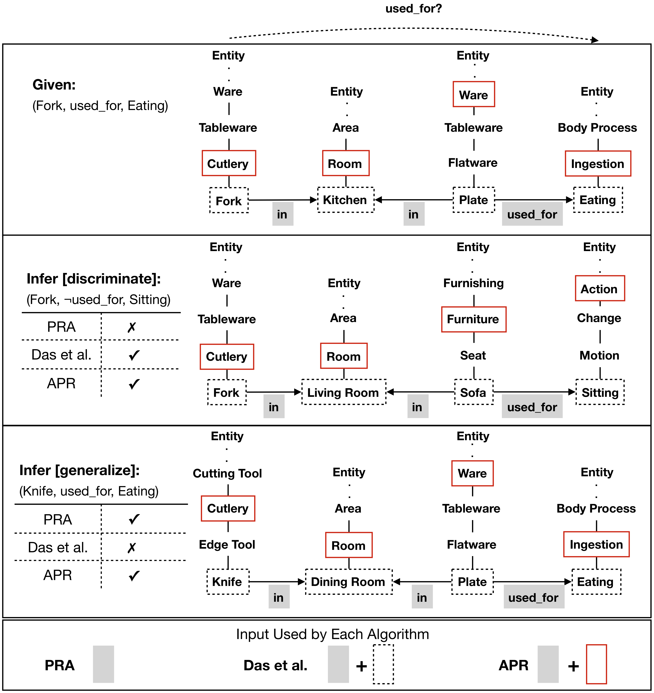

## Path Ranking with Attention to Type Hierarchies
This repo contains code for AAAI 2020 paper *Path Ranking with Attention to Type Hierarchies*.


## Resources
1. Code for baseline models in the paper can be found [here](https://github.com/matt-gardner/pra) (PRA and SFE) and 
[here](https://github.com/rajarshd/ChainsofReasoning) (Path-RNN).
2. We provide tokenized data for WN18RR and FB15k-237. Our data format follows 
[*ChainsofReasoning*](https://github.com/rajarshd/ChainsofReasoning). Vocabularies used for tokenizing data are also
provided for reference.
3. Raw data for WN18RR and FB15k-237 can be found 
[here](https://github.com/TimDettmers/ConvE). Types for WN18RR entities can be obtained from Wordnet. Types for 
FB15k-237 entities can be found [here](https://github.com/thunlp/TKRL).

## Tested platform
* Hardware: 64GB RAM, 12GB GPU memory
* Software: ubuntu 16.04, python 3.5, cuda 8

## Setup
1. Install cuda
2. (Optional) Set up python virtual environment by running `virtualenv -p python3 .`
3. (Optional) Activate virtual environment by running `source bin/activate`
3. Install pytorch with cuda
4. Install requirements by running `pip3 install -r requirements.txt`

## Quick Start for Attentive Path Ranking (APR) model
To help you quickly train and test the model, we have prepared data that are already vectorized. 
 
### Data
1. Vectorized data file can be downloaded from [dropbox](https://www.dropbox.com/s/0a4o2jljg4imuux/data.zip?dl=0).
2. Unzip the file in the root directory of this repo.

### Run the model
1. Use [`run.py`](run.py) to train and test the model on WN18RR or FB15k-237.
2. Use [`main/playground/model2/CompositionalVectorSpaceAlgorithm.py`](main/playground/model2/CompositionalVectorSpaceAlgorithm.py) to modify the training settings and hyperparamters.
3. Use [`main/playground/model2/CompositionalVectorSpaceModel.py`](main/playground/model2/CompositionalVectorSpaceAlgorithm.py) to modify the network design. Different attention methods for
types and paths can be selected here.
4. Training progress can be monitored using tensorboardX by running `tensorboard --logdir runs`. Tutorials and Details can be found [here](https://github.com/lanpa/tensorboardX).

## Running the Complete Knowledge Graph Completion Pipeline
You can also use the code to build knowledge graphs from relation data, sample negative examples, create splits,
extract paths, vectorize path data, run baselines, and run APR model. 

### Data
1. Raw data, including relation data, type information, and word embeddings, for WN18RR, FB15k-237 can be downloaded
from [dropbox]().
2. Unzip the file in the root directory of this repo.

### Install Dependencies
1. Clone our [PRA repo](https://github.com/wliu88/pra_scala) and install necessary dependencies. For more details, check
out readme in that repo.
2. (Optional) Clone our [CVSM repo](https://github.com/wliu88/ChainsofReasoning) only if you want to run CVSM baselines.

### Run
1. Use [`demo_wn18rr.py`](demo_wn18rr.py) or [`demo_fb15k237.py`](demo_fb15k237.py) to go through the whole pipeline for the respective dataset.
2. Use [`run_wn18rr.py`](run_wn18rr.py) or [`run_fb15k237.py`](run_fb15k237.py) if you want to run PRA, SFE, and CVSM baselines

## Code Documentation
Code are documented with docstrings. We also use `sphinx` to automatically generate API documentation from docstrings.

### Viewing the documentation

1. Make sure you have the necessary `pip` dependencies of `sphinx` installed.
1. Navigate to [`docs`](docs/) and build the documentation: `make html`
1. Navigate to [`docs/_build/html`](docs/_build/html) (this folder will be generated by the previous command) and 
start a simple server: `python -m SimpleHTTPServer`.
1. Navigate to [`http://localhost:8000`](http://localhost:8000) in your browser.

## Citation
Please cite the following work if you find the data/code useful.
```text
@inproceedings{liu2019path,
  title = {Path Ranking with Attention to Type Hierarchies},
  author = {Weiyu Liu and Daruna, Angel and Kira, Zsolt and Chernova, Sonia},
  booktitle = {Thirty-Fourth AAAI Conference on Artificial Intelligence (AAAI)},
  year = {2020}
}
```